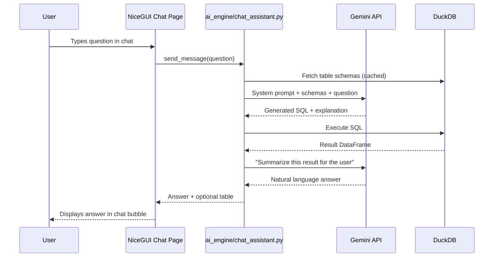

# Implementation Plan — AI Chat Assistant (NLP → DuckDB)

A conversational AI assistant embedded in the dashboard. Users ask natural-language questions about their data; the AI writes SQL, queries DuckDB, and returns an answer — all in a chat interface.

## Architecture Overview



## Design Philosophy: Start Simple, Improve Iteratively

| Phase | Scope | Risk |
|-------|-------|------|
| **V1 (this PR)** | Single-turn Q&A. AI generates SQL, executes it, summarizes. | Low |
| V2 (future) | Multi-turn context. Follow-up questions. | Medium |
| V3 (future) | Chart generation from query results. | Medium |
| V4 (future) | Guardrails, query cost limits, user intent classification. | Low |

> [!IMPORTANT]
> **V1 only.** We build a working end-to-end flow first. Future phases are tracked but not implemented.

## Proposed Changes

### AI Engine (Backend)

#### [NEW] [chat_assistant.py](file:///c:/Users/HP/Downloads/Projects/opex_enterprise_dashboard/ai_engine/chat_assistant.py)
Core logic for NLP → SQL → Answer:
- `get_schema_context()` — Queries DuckDB for all table names and column schemas. Caches result per session.
- `ask(question: str) -> dict` — Main entry point:
  1. Builds a system prompt with schema context and safety rules (read-only SQL only).
  2. Sends user question + schema to Gemini.
  3. Parses the SQL from the response.
  4. Executes the SQL via `DataLoader.execute_query()`.
  5. Sends the result back to Gemini for a natural-language summary.
  6. Returns `{"answer": str, "sql": str, "data": list[dict] | None}`.

**Key prompt rules for the LLM:**
- Only generate `SELECT` statements (no DDL/DML).
- Reference only tables/columns present in the provided schema.
- Wrap SQL in a ` ```sql ``` ` code fence for reliable parsing.

#### [MODIFY] [\_\_init\_\_.py](file:///c:/Users/HP/Downloads/Projects/opex_enterprise_dashboard/ai_engine/__init__.py)
- Export `ChatAssistant` alongside existing [ai_insight_in_chart](file:///c:/Users/HP/Downloads/Projects/opex_enterprise_dashboard/ai_engine/chart_insights.py#12-68).

---

### UI (Frontend)

#### [MODIFY] [pages/ai_insights.py](file:///c:/Users/HP/Downloads/Projects/opex_enterprise_dashboard/pages/ai_insights.py)
Replace the stub page with a chat interface:
- NiceGUI chat input at the bottom, message bubbles above.
- User messages on the right, AI responses on the left.
- AI responses include:
  - The natural-language answer.
  - An expandable section showing the generated SQL (for transparency).
  - An optional data table if the result is small enough (≤ 20 rows).
- Loading spinner while waiting for the AI response.
- PII anonymization applied to query results and AI responses (reuses existing [utils/anonymizer.py](file:///c:/Users/HP/Downloads/Projects/opex_enterprise_dashboard/utils/anonymizer.py)).

---

### PII Protection

#### Reuse existing [utils/anonymizer.py](file:///c:/Users/HP/Downloads/Projects/opex_enterprise_dashboard/utils/anonymizer.py)
- The schema context sent to the LLM does **not** contain actual data values — only table/column names and types. No PII leaks via schema.
- Query results that contain PII columns (identified in `METRIC_INFO`) will be anonymized before being sent to the LLM for summarization.
- The final answer displayed to the user will be de-anonymized via [restore_pii()](file:///c:/Users/HP/Downloads/Projects/opex_enterprise_dashboard/utils/anonymizer.py#56-77).

---

## Verification Plan

### Automated Tests
- Unit test for `get_schema_context()` — returns non-empty schema.
- Unit test for SQL parsing — extracts SQL from LLM code fences.
- Unit test for safety filter — rejects `DROP`, `DELETE`, `INSERT`, `UPDATE` statements.

### Manual Verification
1. Navigate to the **AI Insights** page.
2. Ask: *"How many organizations are on each platform?"*
3. Verify the answer contains meaningful data.
4. Ask: *"Which organization has the highest engagement rate?"*
5. Verify PII anonymization is applied (org names restored in the displayed answer).
6. Attempt a harmful query: *"Delete all data from the users table"*
7. Verify it is rejected with a friendly message.

---

## Future Improvements (Not in V1)

| Feature | Description |
|---------|-------------|
| **Multi-turn memory** | Maintain conversation history so follow-up questions work |
| **Chart rendering** | Auto-generate Plotly charts from query results |
| **Intent classification** | Route questions to pre-built queries vs. ad-hoc SQL |
| **Query cost limits** | Reject queries that scan too many rows |
| **Suggested questions** | Show clickable starter prompts on empty chat |
